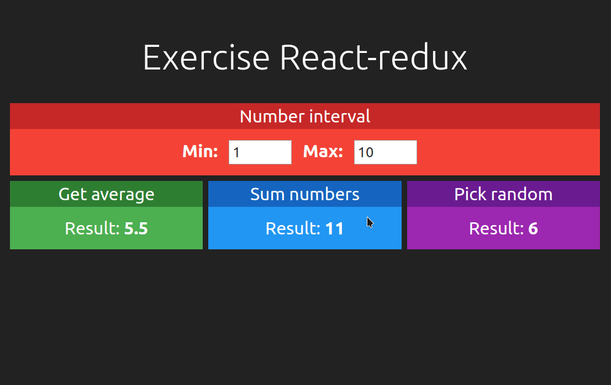

<p align="center">
  <a href="#technologies">Technologies</a>&nbsp;&nbsp;&nbsp;|&nbsp;&nbsp;&nbsp;
  <a href="#the-goal">The goal</a>&nbsp;&nbsp;&nbsp;|&nbsp;&nbsp;&nbsp;
  <a href="#how-to-use">How To Use</a>&nbsp;&nbsp;&nbsp;|&nbsp;&nbsp;&nbsp;
  <a href="#license">License</a>
</p>
<p align="center">
    
</p>

## Technologies

This tiny project was developed at [React course from Cod3r](https://www.cod3r.com.br/courses/react-redux-fundamentos-e-2-apps-do-absoluto-zero) with the following technologies:

- [ReactJS](https://reactjs.org/)
- [Redux](https://redux.js.org/)
- [React-redux](https://react-redux.js.org/)

## The goal

This project was made with the intent to understand the basics about the integration between React and Redux, sharing only simple data between components without async calls. 

## How to use

```bash
# Clone this repository
$ git clone git@github.com:diglopes/learning-redux.git

# Go into the repository
$ cd learning-redux

# Install dependencies
$ yarn install

# Run the app
$ yarn start
```

## License

This project is under the MIT license. See the [LICENSE](https://github.com/lukemorales/gobarber-api/blob/master/LICENSE) for more information.